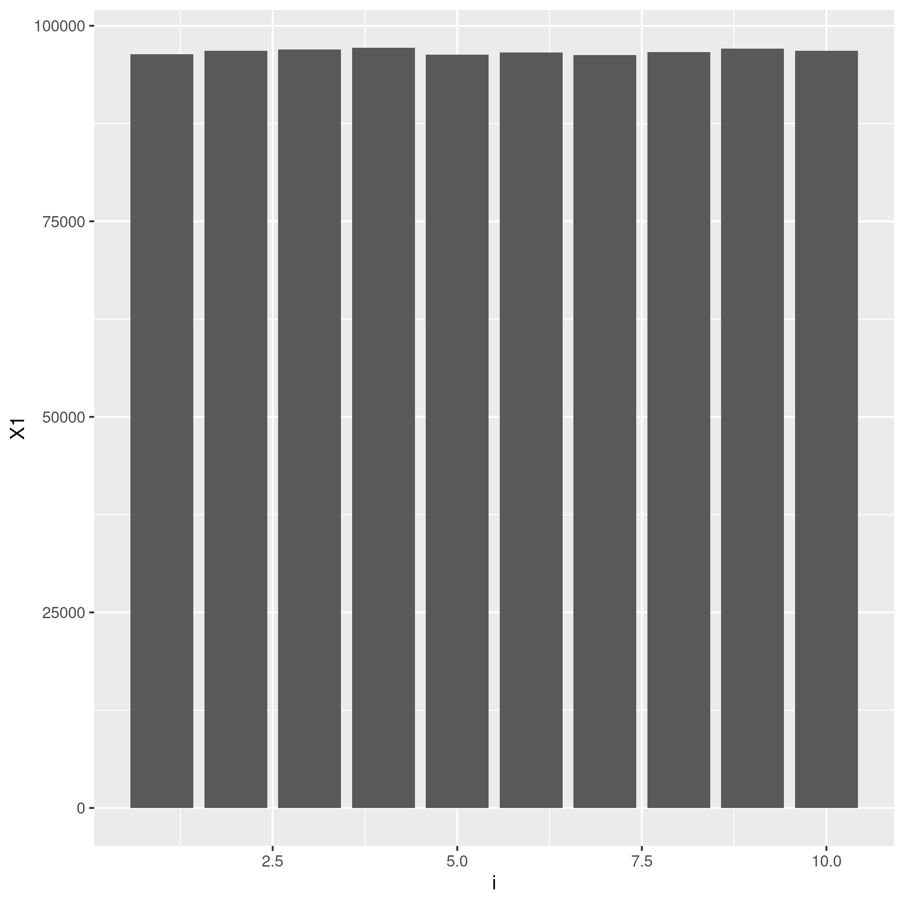
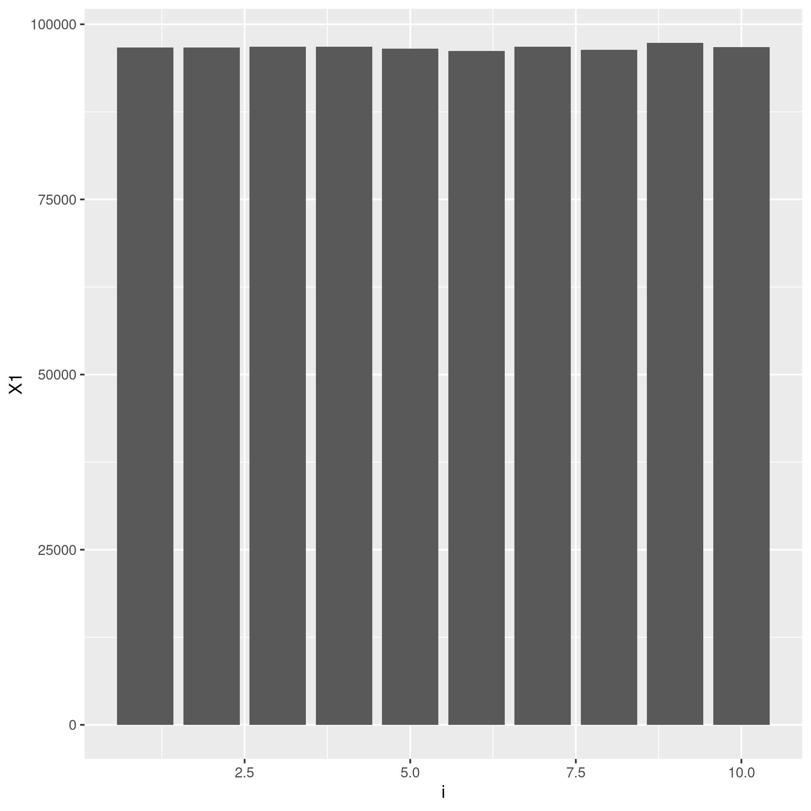

# BLOOM FILTER

## Detecting if something is in a set 

Bloom filters are a table of flags that we can use to determine if a given object is in a larger, harder-to-search set. It's time 
consuming to search a large database. Using a Bloom filter, we can drastically reduce the time it takes to see if something is in
a larger set. A given object will hash to `k` separate flags in the `n` length Bloom filter which we can quickly glance at to 
determine if the item is in a larger set. This filter doesn't have to be correct all the time, it's okay for the filter to 
accidentally have a hit when a hit isn't there. That's still a million times better than looking everything up all the time.

### removing things from a Bloom filter
You probably can't do this. This seems like a bad idea.

## Hash Functions
We had to design hash functions to do this. Both return lambdas that can be used to hash objects for a Bloom filter. Both also take 
`k` and `n` as inputs for the number of flags each object will trigger and the size of the Bloom filter respectively. 

### Hash 1
From what I gather, this is a normal hash function. Given an input, it will use a random number from our given seed to generate a 

### Hash 2

## TESTS AND BENCHMARKING
we tested the 2 hash functions

### graphs are all even which is good
we want an even distribution

n = 10, k = 1, h = 1 

### false positives
higher k is bad for false positives if theres a small n

# I AM TRYING MY HARDEST TO READ PYTHON CODE
