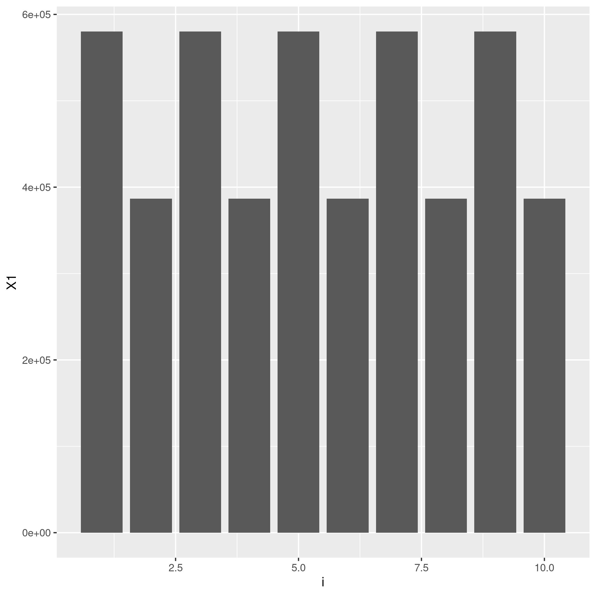
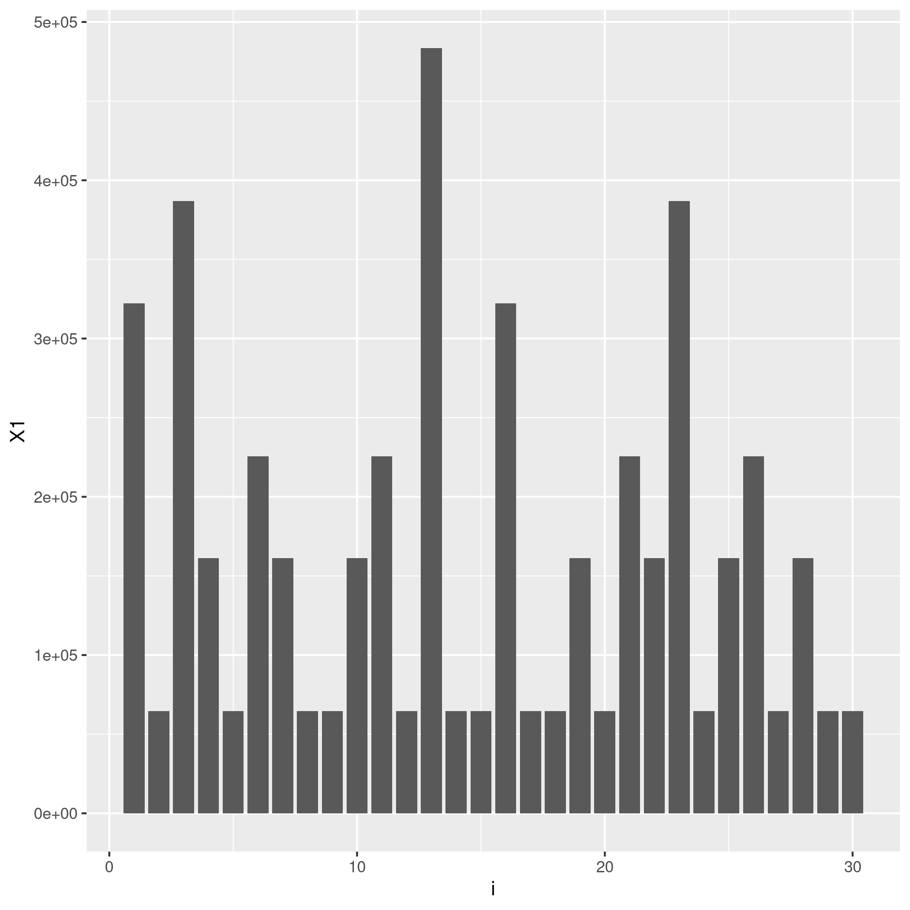
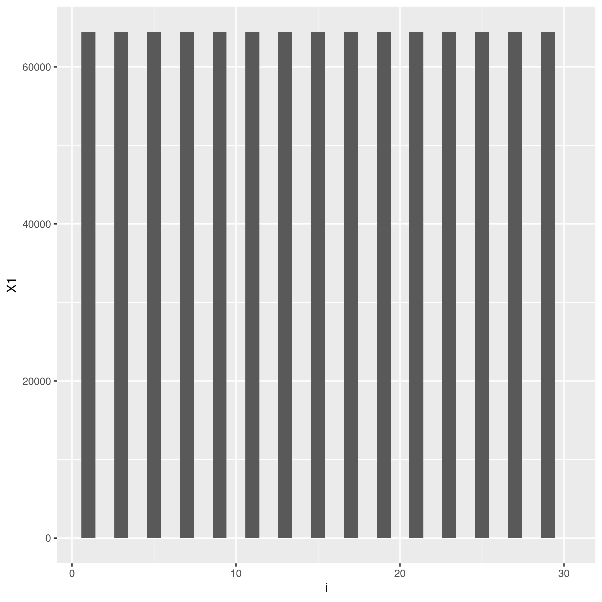
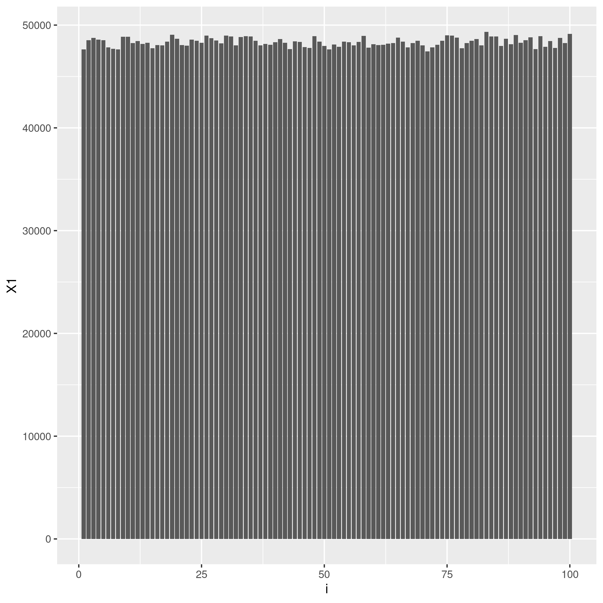
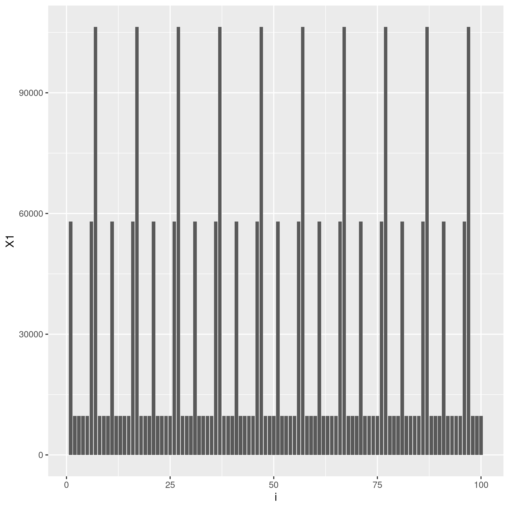
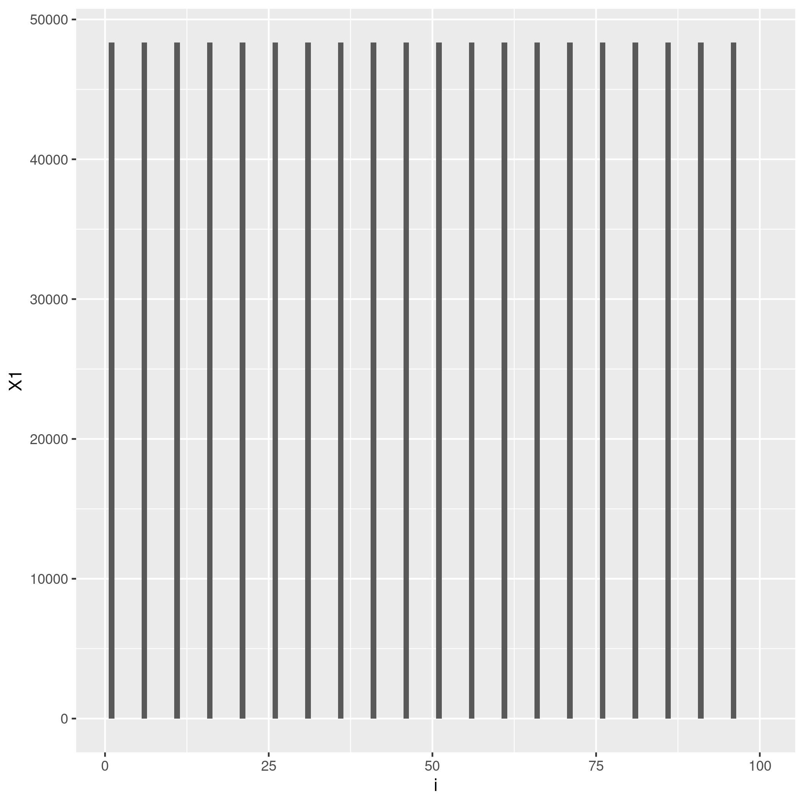
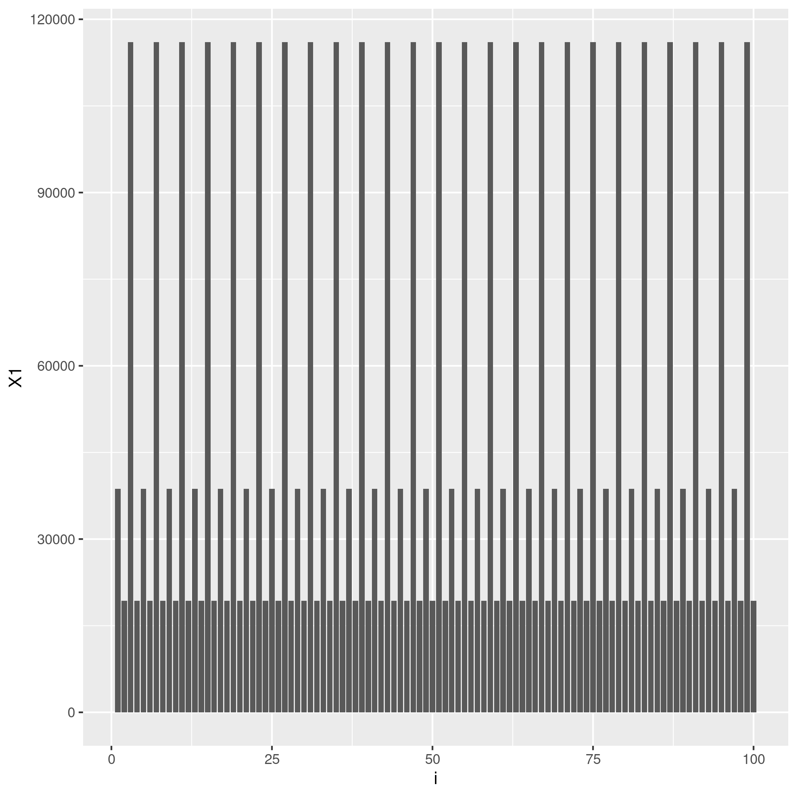
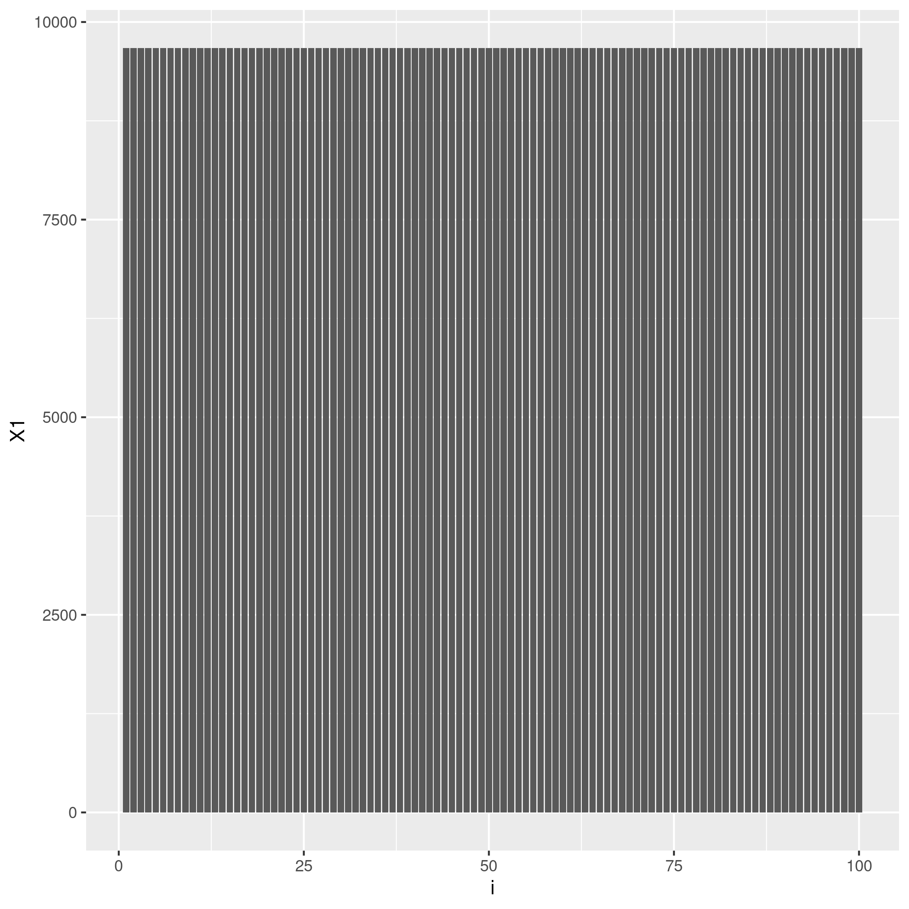
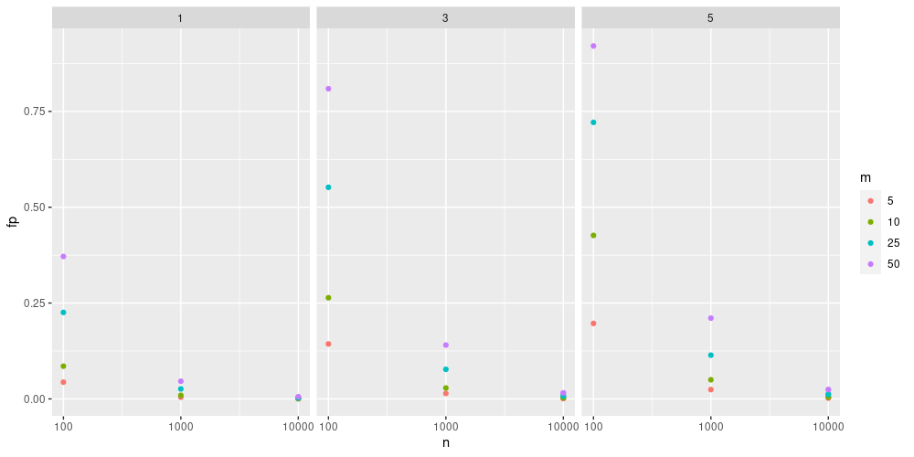

### Hash Functions

Below are some histograms from different settings, where n denotes the size of the bitarray and k denotes the number of hash functions.
Images captioned "all" show the count of outputs across all hash functions, whereas "first" show the count of outputs for a single hash function.

n = 10, k = 1, hash = 1 

all: 
first: 

n = 10, k = 1, hash = 2 

all: 
first: 

n = 10, k = 5, hash = 2 

all: 
first: 

n = 30, k = 5, hash = 2 

all: 
first: 

n = 100, k = 5, hash = 1 

all: 
first: 

n = 100, k = 3, hash = 2 

all: 
first: 

n = 100, k = 5, hash = 2 

all: 
first: 

Ideally, the hash function will map into its range uniformly. 
We can see that while hash function 1 is doing so, hash function 2 is resulting in an uneven mapping in the overall count.
While all firsts for hash function 2 is mapping uniformly (in a way that doesn't utilize [0,n-1] completely, which is unideal),
we can see that different functions in the same group tend to have a smaller range than what is possible, thus reducing entropy and the filter performance.

### False Positive Rate

The above graph is faceted with the number of hash functions.
n denotes the size of the bitarray and m denotes the number of elements in the filter.
Unsurprisingly, the false positive rate decreases as the size of the bitarray increases.
In these settings, false positive rate is increasing as the number of hash functions increases.
Also unsurprisingly, adding more items to the filter also increases the false positive rate.

### Extensions

We have additionally implemented Counting Bloom Filters and Deletable Bloom Filters, as described in *Theory and Practice of Bloom Filters for
Distributed Systems* paper.
